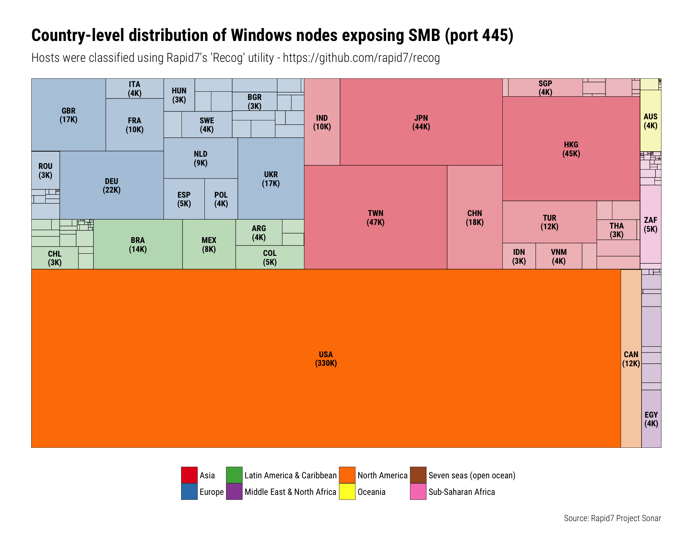

# Sonar WannaCry Country Treemap
Rapid7 Labs (research@rapid7.com)  
2017-05-22  


The following is a bit of the code & data used to produce the `#WannaCry` visualizations in various Rapid7 blog posts and tweets, including [this one](https://community.rapid7.com/community/infosec/blog/2017/05/16/update-on-wannacry-vulnerable-smb-shares-are-widely-deployed-and-people-are-scanning-for-them).

We'll need some library help:


```r
library(igraph)
library(ggraph)
library(hrbrthemes)
library(tidyverse)
```

The `sonar445` variable is a data frame of sanitized data from our Sonar 445 scan. Even country-level attribution with paid MaxMind feeds have larger error rates than MaxMind claims, but that's not a real problem when there are large numbers of hosts.

The `base_df` is metadata about countries and continents that make it easy to create the treemap topology.


```r
sonar445 <- read_rds("data/445-nodes.rds")

base <- jsonlite::fromJSON("data/base-data.json")
base_df <- map_df(base$children$children, ~select(.x, iso31661a3, country, alt_name, oii_reg))
```

We first need to summarise the counts by country:


```r
count(sonar445, country) %>% mutate(ct = n) -> countries
```

Then, we join the country data to the metadata data frame:


```r
(left_join(base_df, countries) %>% tbl_df() -> vis_df)
```

```
## # A tibble: 249 x 6
##    iso31661a3         country                            alt_name oii_reg
##         <chr>           <chr>                               <chr>   <chr>
##  1        PRK     North Korea Korea, Democratic People's Republic    Asia
##  2        MDV        Maldives                            Maldives    Asia
##  3        BTN          Bhutan                              Bhutan    Asia
##  4        BRN          Brunei                   Brunei Darussalam    Asia
##  5        MAC           Macao                               Macau    Asia
##  6        TKM    Turkmenistan                        Turkmenistan    Asia
##  7        MNG        Mongolia                            Mongolia    Asia
##  8        MMR Myanmar [Burma]                             Myanmar    Asia
##  9        LAO            Laos    Lao People's Democratic Republic    Asia
## 10        KHM        Cambodia                            Cambodia    Asia
## # ... with 239 more rows, and 2 more variables: n <int>, ct <int>
```

The treemap visualizes a hierarchical relationship. We need to build that with a network graph edge list:


```r
bind_rows(
  data_frame(from = "World", to = unique(base_df$oii_reg)),
  select(vis_df, from = oii_reg, to = country)
) -> edges_df
```

But, to get info on the nodes, we need to have metadata attached to the nodes in a vertex list:


```r
bind_rows(
  data_frame(name = "World", region = "World", short = "", ct = 0),
  data_frame(name = unique(vis_df$oii_reg), region = unique(vis_df$oii_reg), short = "", ct = 0),
  select(vis_df, name = country, region = oii_reg, ct, short = iso31661a3)
) -> vertex_df
```

I keep trying to make the ordering more deterministic and geographically representative (this is one attempt).  We also don't need non-existent regions in the treemap.


```r
ordr <- c(
  "World" = 9,
  "Asia" = 5,
  "Europe" = 3,
  "Latin America & Caribbean" = 2,
  "Middle East & North Africa" = 4,
  "North America" = 1,
  "Oceania" = 6,
  "Seven seas (open ocean)" = 9,
  "Sub-Saharan Africa" = 7
)

vertex_df <- mutate(vertex_df, srt = ordr[region])
vertex_df <- filter(vertex_df, !is.na(ct))

edges_df <- filter(edges_df, to %in% unique(vertex_df$name))
```

We can't label everything in a non-interactive chart, so we have to be picky (and also try to make nice labels when we do use labels):


```r
vertex_df <- mutate(vertex_df, short = ifelse(ct<2500, "", 
                                              sprintf("%s\n(%sK)", 
                                                      short, 
                                                      scales::comma(round(ct / 1000)))))
```

Now, we build the graph, marking leaf nodes and ensuring the smallest value is 1 (a limitation of the `ggraph` package and not strictly necessary here since we're not dealing with 0-1 percentages):


```r
graph_df <- graph_from_data_frame(edges_df, vertices=vertex_df)

V(graph_df)$leaf <- degree(graph_df, mode = 'out') == 0
V(graph_df)[(V(graph_df)$leaf) & (is.na(V(graph_df)$ct))]$ct <- 1
V(graph_df)[(V(graph_df)$leaf) & (V(graph_df)$ct == 0)]$ct <- 1
```

Finally, make the treemap:


```r
ggraph(graph_df, 'treemap', sort.by = 'srt', weight = 'ct') +
  geom_node_tile(aes(fill = region, alpha = ct), size = 0.15) +
  geom_node_text(aes(label = short), family = font_rc, fontface = "bold", size = 3, lineheight = 0.9) +
  scale_x_reverse(expand = c(0,0)) +
  scale_y_reverse(expand = c(0,0)) +
  scale_alpha(trans = "sqrt", guide = "none") +
  scale_fill_brewer(name = NULL, palette = "Set1", breaks = names(ordr)[-1]) +
  labs(x = NULL, y = NULL, 
       title = "Country-level distribution of Windows nodes exposing SMB (port 445)",
       subtitle = "Hosts were classified using Rapid7's 'Recog' utility - https://github.com/rapid7/recog",
       caption = "Source: Rapid7 Project Sonar") +
  theme_ipsum_rc(grid = "") +
  theme(panel.border = element_blank()) +
  theme(axis.text = element_blank()) +
  theme(legend.position = "bottom")
```


